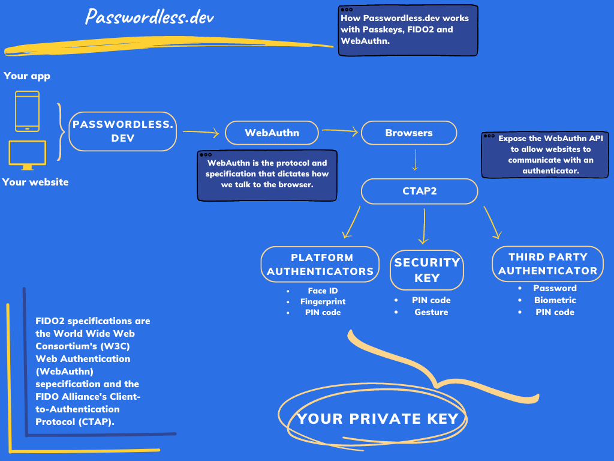

# About passwordless.dev

Passwordless.dev is a software toolkit that helps web developers provide [FIDO2 WebAuthn passkeys](concepts.html#fido2) for end-user authentication. Using passwordless.dev means there's no need to: read extensive W3C specification documentation, determine what cryptography to implement, or worry about managing stored public keys. The team behind Bitwarden will take care of that for you.

Passwordless.dev wraps FIDO2 WebAuthn passkey functionality in easy-to-use tools, designed to make it faster for web developers to adopt passkey-based authentication, and meet the challenges of an ever-shifting cybersecurity landscape.

The passwordless.dev architecture consists of three key parts:

- An [open-source client side library](js-client), used by your frontend to make requests to end-users browsers' WebAuthn API and requests to the passwordless.dev APIs.
- A public RESTful API, used by the client-side library to complete FIDO2 WebAuthn cryptographic exchanges with the browser.
- A [private RESTful API](api), used by your backend to initiate key registrations, verify signins, and retrieve keys for end-users.

::: tip
For more information on the principles that support passwordless.dev, check out [Concepts](concepts). If you are ready to start using passwordless.dev, visit [Get Started](get-started) for step-by-step instructions.
:::
