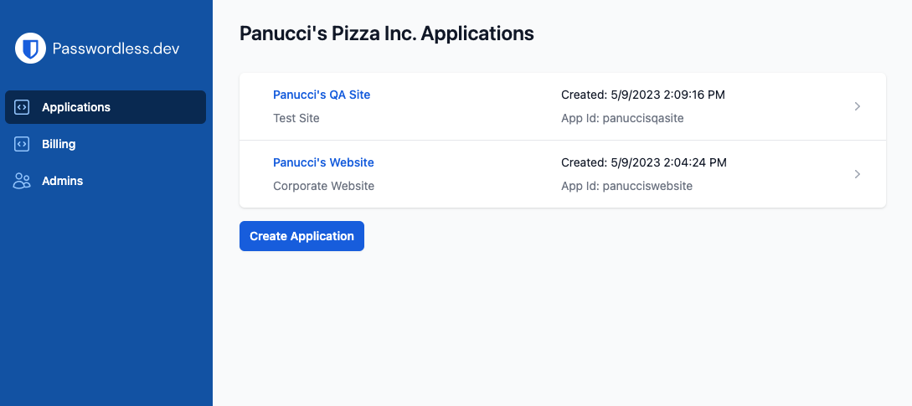
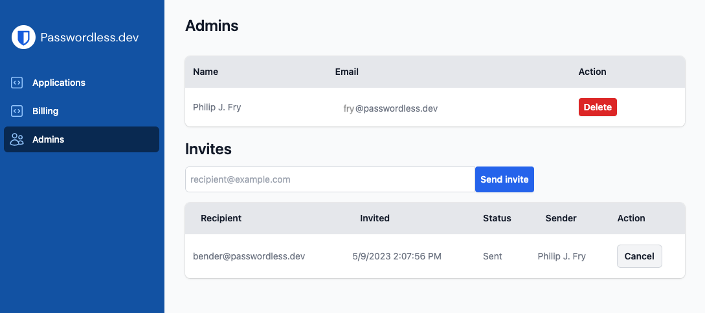

# Admin Console

The [Admin Console](https://adminconsole-devtest.azurewebsites.net/Account/Login) is your primary GUI for creating and configuring applications, monitoring application usage, and managing billing:

Once you create a new application, you'll have a handful of pages available to you.

## Applications

The number of applications you can create depends on your [plan](plans). Select an application to view the following components:

### Get started

The **Get Started** page walks you through the preliminary steps for getting passwordless.dev running in your application. This information is very similar to what's documented in the [Get Started](get-started) guide.

:::warning
This page contains your [API keys](concepts.html#api-keys). It's important to download your API keys to a safe place, as they will be removed from the admin console after 7 days.
:::

### Users

The **Users** page allows you to monitor the end-users with FIDO2 WebAuthn passkeys registered for your application. For each user, as determined by their `userId`, you'll be able to view:

#### Credentials

Credentials registered to each user are listed. [Learn what data is stored for each credential](concepts.html#credentials).

#### Aliases

Aliases registered to teach user are listed, however aliases that are hashed cannot be viewed here ([learn more](api.html#alias)).

### Settings

The **Settings** page will offer some options for configuring your application. More to come.

### Playground

The **Playground** page gives access to a simple passwordless demo you can use for testing devices.

## Billing

The **Billing** page

## Admins

The **Admins** page allows you to invite other administrators to your passwordless.dev organization to manage applications, billing, and more. All admins, including whomever created the passwordless.dev account and any applications, have **equal permissions within the organization**.

To invite an admin:

1. Enter an email address in the **Invitees** text input and select **Send Invite**.
2. Your future-admin will receive an invite email. Instruct them to use this invite to complete registration for passwordless.dev and, subsequently, to follow the email verification step.

Admins can be deleted from this same page.

:::warning
Due to all admins having equal permissions within the organization, it is currently possible for a newly-invited admin to delete a previously-provisioned admin from the organization.
:::
